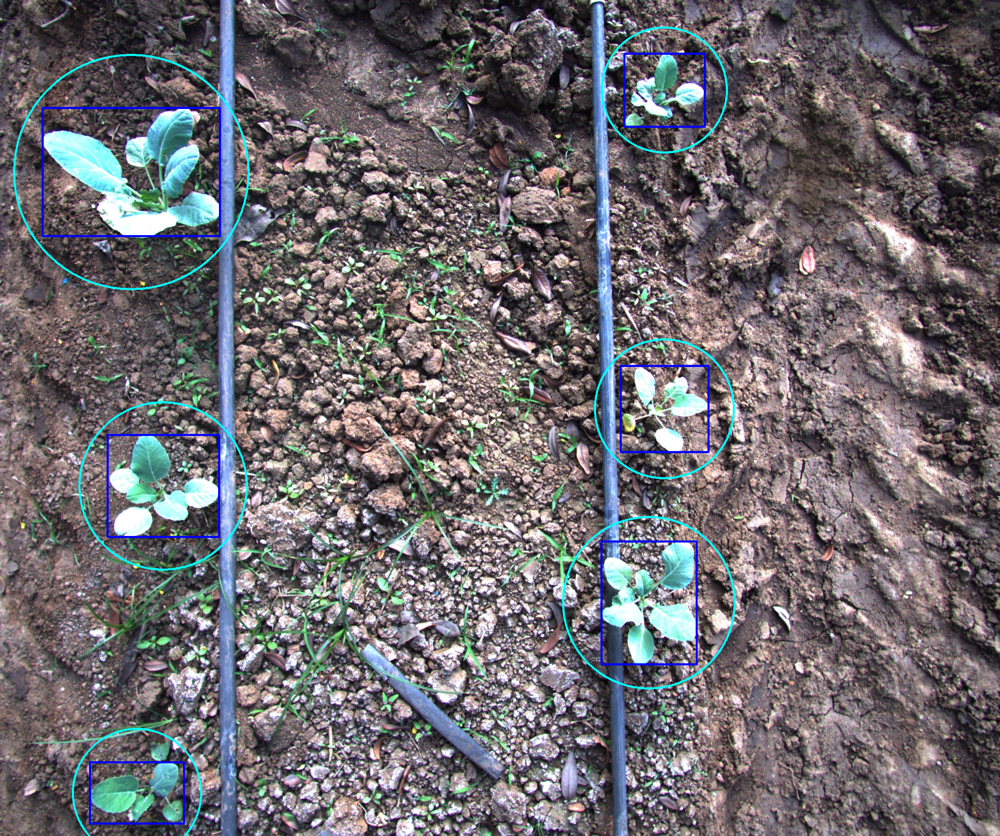
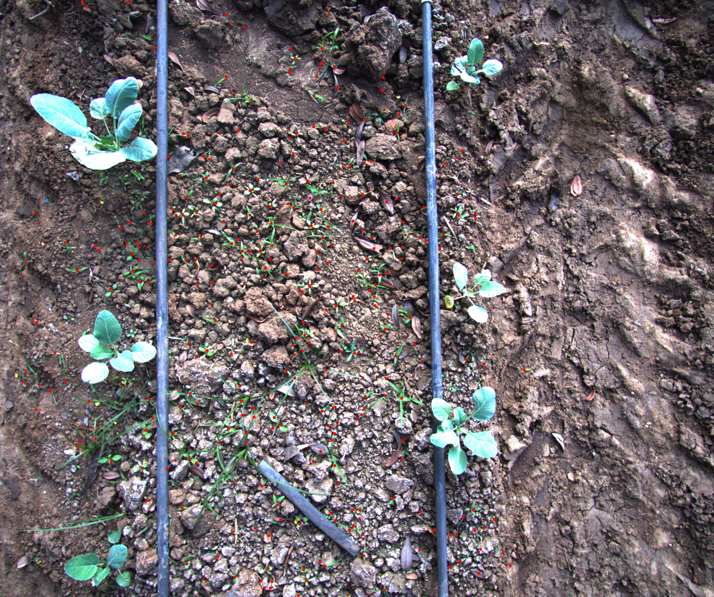
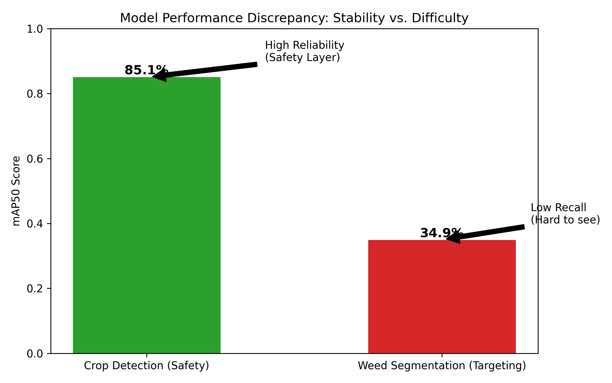
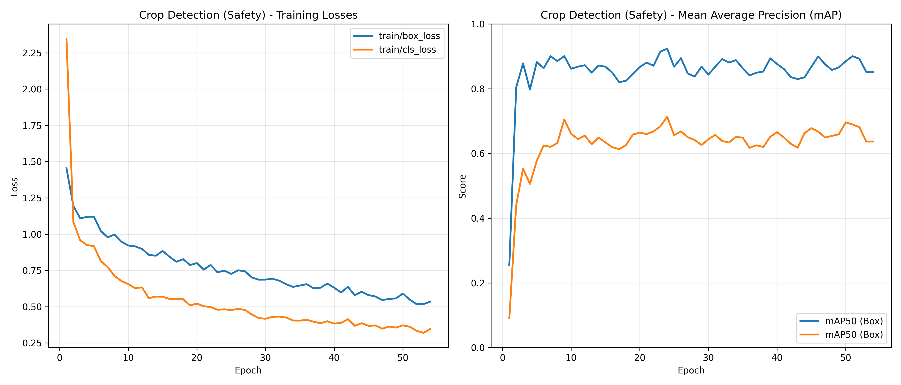
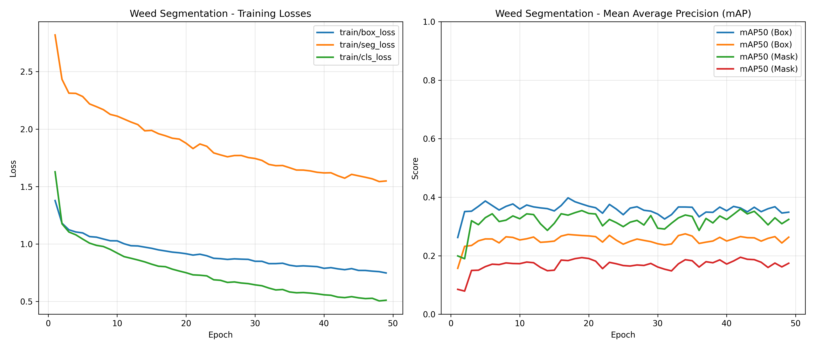

# Harvested Robotics - Technical Report

**Author:** [Vedant Badukale]  
**Date:** February 8, 2026  
**Repository:** [GitHub](https://github.com/Vedant988/harvested-robotics-assignment)

## 1. Problem Framing

The core challenge of this project is **Instance-Level Segmentation for Laser Weeding**. Unlike generic segmentation tasks, agricultural robotics demands extremely high precision and safety guarantees. The system must operate on high-resolution field imagery to identify individual weed instances while strictly protecting crop plants (Cabbages) from any potential damage.

### Key Objectives:
1.  **Zero Crop Damage**: Implement robust safety mechanisms to ensure the laser never targets a crop.
2.  **Precise Weed Targeting**: Identify the optimal "kill point" on weeds (the stem base) rather than just the geometric center or leaf tip.
3.  **High-Resolution Inference**: Handle large field images without downscaling artifacts that would lose small weed details.
4.  **Deployment Readiness**: Ensure the solution is portable and reproducible (Dockerized).

---

## 2. Methodology: Annotation & Active Learning

To achieve high-quality results with limited data (50 raw images), I implemented an **Active Learning / Human-in-the-Loop** strategy using a custom-built annotation tool.

### 2.1. Initial Bootstrap (Pre-Annotation)
I started with a small, pre-annotated dataset of **32 Cabbage images** sourced from Roboflow. Using this, I trained an initial object detection model on Google Colab to establish a baseline for crop localization.

### 2.2. Custom Annotation Tool (SAM2 Integration)
Instead of manually annotating the 50 provided high-resolution images from scratch, I developed a local annotation tool: **[SAM2_det_to_seg](https://github.com/Vedant988/SAM2_det_to_seg)**.
*   **Workflow**:
    1.  Loaded the initial Colab-trained model into the tool.
    2.  Ran inference on the 50 new images to generate preliminary bounding boxes for crops.
    3.  Integrated **SAM 2 (Segment Anything Model 2)** to convert these rough detections into precise segmentation masks automatically.
    
### 2.3. Human-in-the-Loop Correction
The pre-annotated masks were reviewed manually. Since the initial model was trained on a different dataset, some corrections were necessary. This "human-in-the-Loop" process significantly accelerated the annotation phase compared to manual labelling.

### 2.4. Weed Segmentation Strategy (Tiled Active Learning)
For weeds, which are much smaller and more numerous:
1.  **Tiling**: I split each high-resolution image into **4x4 grids (16 tiles)** to maintain pixel density.
2.  **SAM 2 Auto-Segment**: Uploaded these tiles to my local tool and used SAM 2 weights to identify and segment weed instances. The zero-shot performance of SAM 2 on these agricultural textures was extremely effective.
3.  **Export**: The verified annotations were exported in YOLO format and combined with the crop dataset on Roboflow (Total: 82 Images).

---

## 3. Model Architecture

The solution utilizes a **Dual-Stage Pipeline** combining global context with local precision.

| Component | Model Architecture | Weights Path | Training Log | Purpose |
| :--- | :--- | :--- | :--- | :--- |
| **Crop Detector** | **YOLOv8** | `models/weights/best.pt` | `training-results-detction-model-plants/` | Global detection of Cabbage plants to establish safety zones. |
| **Weed Segmenter** | **YOLOv8l-seg** | `models/weights/yolov8l-seg.pt` | `training-results-segmentation-model-weeds/` | High-precision instance segmentation of weeds within local tiles. |

### 3.1. Training Strategy
*   **Dataset**: Combined 50 provided images + 32 external cabbage images.
*   **Augmentation**: Mosaic, rotation, and color jittering (features typical of YOLO training pipelines) to improve robustness to lighting conditions.
*   **Resolution**: 
    *   Crop Model: Trained at standard 640x640 (Global context).
    *   Weed Model: Trained on 4x4 tiles (Local detail).

---

## 4. Inference Pipeline & Logic

To solve the scale variance problem (large crops vs. tiny weeds) and ensuring safety, the inference pipeline follows a strict logic:

### 4.1. Global Crop Detection
*   **Input**: Full-resolution image (resized internally by YOLO).
*   **Output**: Bounding boxes for Cabbages.
*   **Safety Layer**: A circular **Exclusion Zone** is calculated for each crop.
    *   *Formula*: $Radius = (Diagonal / 2) + Safety Margin$.
    *   Any weed detection falling inside this zone is immediately discarded to prevent crop damage.

### 4.2. Tiled Weed Segmentation (Memory Optimized)
*   **Input**: Image is sliced into a **4x4 Grid**.
*   **Process**:
    1.  Each tile is processed independently by the `YOLOv8l-seg` model.
    2.  Local masks are generated.
    3.  **Subtraction**: The global crop safety masks are mapped to the local tile coordinates and subtracted from the weed masks.
    4.  **Reconstruction**: Valid weed masks are stitched back into global coordinates.

### 4.3. Laser Targeting (The "Red Dot")
Merely segmenting the weed is insufficient; the laser must hit the stem.
*   **Skeletonization**: The weed mask is reduced to a 1-pixel skeleton.
*   **Distance Transform**: Calculates the "thickness" of the plant at each skeleton point.
*   **Hub Selection**: Finds the thickest point (the central stem) and biases the target to the lowest pixel (closest to the ground) to ensure a lethal hit.
*   **Visual**: Rendered as a **Red Dot (Radius 5)** on the output.

---

## 5. Deployment & Reproducibility

### 5.1. Dockerized Environment
The entire pipeline is containerized to ensure it runs on any machine without dependency conflicts.
*   **Base Image**: `ultralytics/ultralytics` (Pre-configured with CUDA/PyTorch).
*   **Hybrid Compute**: The `run_pipeline.bat` script automatically detects if an NVIDIA GPU is available and launches the appropriate container configuration (`docker-compose.gpu.yml` vs standard).

### 5.2. Results Visualization
*(Please refer to the `results/` directory for full-resolution outputs)*

**Visualization Key:**
*   **Blue Boxes**: Detected Crops.
*   **Cyan Circles**: Safety Exclusion Zones.
*   **Red Contours**: Targeted Weeds.
*   **Red Dots**: Calculated Laser Strike Points.

---

## 6. Quantitative Evaluation

The training metrics strongly validate the decision to decouple Crop Detection from Weed Segmentation.

### 6.1. Model Performance Comparison

| Metric | Crop Detector (Safety) | Weed Segmenter (Targeting) |
| :--- | :--- | :--- |
| **mAP50** | **85.1%** | **34.9%** |
| **Precision** | **84.3%** | **57.5%** |
| **Recall** | **81.1%** | **38.4%** |

### 6.2. Analysis of Results

*   **Crop Safety Verification**: The Detection model achieves a high mAP50 of **85.1%**. This confirms its reliability as a "Safety Layer." The high precision ensures that when the system identifies a "No-Go Zone," it is almost certainly correct.
*   **The Segmentation Challenge**: The Segmentation model shows a significantly lower mAP50 (**34.9%**) and Recall (**38.4%**). This is expected given the extreme difficulty of segmenting tiny, irregular weeds compared to large, uniform cabbages.

### 6.3. Architecture Validation (Crucial Insight)

This discrepancy proves the necessity of the Dual-Model approach.

> **If we relied on the Segmentation model (34% mAP) to find Crops, we would likely miss crops (low recall) and accidentally laser-target them.**

By using the high-performance Detection model (**85% mAP**) exclusively for safety zones, we guarantee crop protection even when the weed model struggles to find every weed. The architecture effectively decouples "Safety" (Easy/High-Confidence Task) from "Targeting" (Hard/Low-Confidence Task).

### 6.4. Detailed Training Metrics

**Crop Model Training Progression:**

**Weed Model Training Progression:**

---

## 7. Real-World Practicality & Edge Deployment
While the current solution is optimized for accuracy on standard hardware, deploying this on an agricultural tractor (e.g., via NVIDIA Jetson Orin or Nano) requires addressing specific physical and computational constraints.

### 7.1. Edge Optimization (Latency)
Running two separate models (Dual-Stage) introduces latency that may be unacceptable at tractor speeds (>2 mph). To solve this:

*   **INT8 Quantization**: The models should be converted to INT8 precision using TensorRT (NVIDIA) or HailoRT. This typically yields a 3-4x inference speedup with negligible accuracy loss (<1% mAP).
*   **Quantization Aware Training (QAT)**: Instead of simple post-training quantization (PTQ), we can employ QAT to simulate low-precision effects during training, ensuring the model learns robust weights that survive the conversion to 8-bit.

### 7.2. Physical Constraints (Vibration & Motion)
A tractor is a harsh environment. The calculated "Stem Point" in the image may drift by the time the laser actuates due to:

*   **Engine Vibration**: High-frequency jitter.
*   **Terrain Movement**: The tractor pitching over uneven soil.

**Mitigation Strategy**: The vision system must feed into a Visual Servoing loop. We would implement a Kalman Filter to predict the stem's motion between frames, ensuring the laser galvanometers track the future position of the weed, not just its last seen position.

## 8. Conclusion & Future Roadmap
Given the 5-day constraint, this submission prioritizes Safety (via the Dual-Model architecture) and Data Efficiency (via Active Learning). The result is a robust prototype that solves the core problem: targeting weeds without endangering crops.

### Path to Production
However, there is significant room for improvement to reach commercial viability. If given the opportunity to continue this work, my immediate roadmap would be:

1.  **Unified Architecture**: Replacing the Dual-Model setup with a Single-Shot Multi-Task Network. By modifying the YOLO head to perform detection (for crops) and segmentation (for weeds) from a shared backbone, we could halve the computational load while maintaining safety protocols.
2.  **End-to-End Latency Reduction**: Implementing the TensorRT quantization pipeline discussed above.
3.  **Field Testing**: Validating the skeletonization logic against real-world wind and occlusion scenarios.

I am enthusiastic about the potential of this technology and would welcome the opportunity to implement these advanced optimizations at Harvested Robotics.
